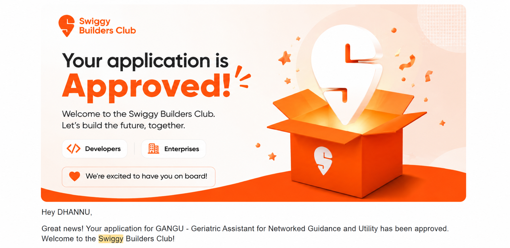

# GANGU

<div align="center">

### Voice-first grocery assistance for older Indian adults and their families

Speak or type naturally in **Hindi, English, or Hinglish**. GANGU turns a household need into a structured plan, compares available options, explains its recommendation, and asks for explicit confirmation before any order action.

[](https://gangu.vercel.app/)
[](https://gangu-api.onrender.com/)
[](frontend/)
[](api/)

**[Try GANGU](https://gangu.vercel.app/)** · **[Explore the architecture](ARCHITECTURE.md)** · **[Read the MCP setup guide](MCP_SETUP_GUIDE.md)**

</div>

---

## Swiggy Builders Club approval

> [!IMPORTANT]
> **GANGU's application to the Swiggy Builders Club has been approved by Swiggy.** The project includes a Swiggy Instamart MCP client, OAuth 2.1/PKCE preparation, a production callback endpoint, and dual-platform search orchestration.

<p align="center">
  
</p>

<p align="center"><sub>Privacy-safe excerpt of the approval notice. Private contact details and onboarding links have been omitted.</sub></p>

The approval is an external validation milestone for GANGU. The repository contains the Swiggy authorization flow, authenticated MCP client structure, single-use OAuth state, callback exchange, and encrypted token-storage option required for a secure provider connection.

---

## The problem

Many older adults know what they need but are uncomfortable navigating changing grocery-app interfaces, filters, carts, substitutions, and checkout screens. A simple request such as:

> “Doodh khatam ho gaya, le aao.”
>
> “Please bring milk; we have run out.”

should not require learning another complicated interface.

GANGU provides a voice-first layer that converts the request into transparent steps while keeping the user in control. It is designed to reduce interaction complexity—not to make silent purchasing decisions.

## What GANGU does

- Accepts voice or text in Hindi, English, and Hinglish.
- Extracts the requested item, quantity, urgency, preferences, and ambiguity.
- Builds an execution plan through a LangGraph multi-agent workflow.
- Launches **Zepto Cafe MCP and Swiggy MCP searches in parallel** for product requests.
- Combines successful connector responses into one normalized cross-platform result set.
- Normalizes pack sizes, prices, stock signals, delivery estimates, and ratings.
- Ranks options and explains the trade-offs behind the recommendation.
- Shows a final review before confirmation.
- Streams each agent's progress to the frontend through authenticated WebSockets.
- Defaults to dry-run mode so estimated or unverified data cannot become a real order.

## Current product status

| Area | Status | Notes |
|---|---|---|
| Responsive web experience | **Live** | Deployed on Vercel |
| FastAPI orchestration service | **Live** | Deployed on Render |
| Google and phone authentication | **Implemented** | Firebase Authentication |
| Six-agent grocery workflow | **Implemented** | LangGraph with rule-based fallbacks |
| Zepto Cafe MCP | **Working** | MCP search client with a catalog fallback for supported products |
| Swiggy Instamart MCP | **Implemented + approved project** | Parallel MCP search client, OAuth/PKCE flow, and production callback; Builders Club application approved |
| Real purchases | **Disabled** | Requires verified live data plus two explicit server-side switches |
| Lists, family, and settings persistence | **Browser-local** | Server-side persistence is planned |

---

## How it works

```mermaid
flowchart LR
    U[Voice or text request] --> F[Next.js interface]
    F --> A[Firebase authentication]
    A --> API[FastAPI API]
    API --> G[LangGraph workflow]
    G --> I[1. Intent extraction]
    I --> P[2. Task planning]
    P --> S[3. Parallel MCP search]
    C --> D[5. Decision and safety]
    D --> R[6. Review / purchase boundary]
    R --> N[User notification]
    S --> Z[Zepto Cafe MCP]
    S --> SW[Swiggy Instamart MCP]
    Z --> M[Normalize and merge results]
    SW --> M
    M --> C
```



The graph has six core agents plus notification and informational-query nodes. Buy/reorder intents enter the complete search-and-decision path; other requests are routed to the informational path. Connector failures are isolated, so one unavailable platform does not discard a valid result from the other.

### End-to-end request flow

1. **Understand:** extract the product, quantity, urgency, language, and missing details from Hindi, English, or Hinglish.
2. **Plan:** convert the intent into an ordered grocery-assistance task.
3. **Search both MCP connectors:** launch Zepto Cafe MCP and Swiggy MCP concurrently with `asyncio.gather`.
4. **Normalize:** map successful responses into a shared schema for price, quantity, stock, delivery, rating, platform, product ID, and source.
5. **Compare:** rank products using unit price, speed, quality, availability, quantity match, urgency, and data confidence.
6. **Decide:** apply confidence and safety policies; select, ask a preference, request clarification, or reject unsafe options.
7. **Review:** present the recommendation, alternatives, reason, address, price source, and transaction mode.
8. **Confirm and notify:** consume a user/session-bound quote and return the final dry-run or verified transaction outcome.

### How product decisions are made

GANGU does not select a product using price alone. It first normalizes results to comparable units and then evaluates:

| Signal | Why it matters |
|---|---|
| Unit price | Prevents a smaller pack from appearing cheaper unfairly |
| Delivery speed | Becomes more important when the request is urgent |
| Rating and review confidence | Helps avoid low-quality or weakly supported options |
| Availability and stock risk | Rejects unavailable products and flags low stock |
| Quantity match | Prefers the pack size closest to the user's actual need |
| Platform and data confidence | Prevents estimated/demo data from being treated as verified live data |

The comparison agent creates a ranked result. The decision agent then applies safety and confidence policies and returns one of four outcomes:

- `auto_buy` — an internal recommendation state; the API still enforces the final confirmation boundary.
- `confirm_with_user` — options are close or a preference is required.
- `clarify_needed` — the request or result is too ambiguous or risky.
- `no_good_option` — no acceptable option is available.

The UI shows the selected product, reason, alternatives, price source, address, and transaction mode before confirmation.

---

## Safety and trust by design

- **Explicit final confirmation:** no purchase endpoint is called from the initial natural-language request.
- **Single-use quotes:** confirmation requires a short-lived quote tied to the authenticated user, session, and selected product.
- **Dry-run by default:** `GANGU_DRY_RUN=true` and `ENABLE_REAL_PURCHASES=false` in the production blueprint.
- **Verified-source requirement:** estimated catalog entries cannot be converted into real orders.
- **Authenticated APIs:** Firebase ID tokens protect HTTP endpoints.
- **Safer WebSockets:** short-lived, single-use tickets keep long-lived Firebase tokens out of socket URLs.
- **OAuth protections:** the Swiggy authorization path uses OAuth 2.1-style PKCE and single-use expiring state.
- **Encrypted token option:** multi-worker MongoDB storage encrypts Swiggy OAuth tokens at rest.
- **Honest interface labels:** live, estimated, local-only, onboarding, and dry-run states are shown to users.

---

## Technology

| Layer | Technologies |
|---|---|
| Frontend | Next.js 16, React 19, TypeScript, Zustand, Framer Motion, Tailwind CSS |
| Authentication | Firebase Google sign-in and Indian mobile OTP |
| Backend | Python 3.11, FastAPI, WebSockets, Pydantic |
| AI workflow | LangGraph, Google Gemini (configurable through `LLM_MODEL`) |
| Integrations | Model Context Protocol, HTTP/SSE, Playwright-based catalog connector |
| State | In-memory for the current single-worker deployment; MongoDB implementation for multi-worker state |
| Deployment | Vercel frontend, Render backend |

## Key repository areas

```text
GANGU/
├── agents/             # Intent, planning, search, comparison, decision, purchase
├── api/                # FastAPI routes, auth, sessions, OAuth and WebSockets
├── frontend/           # Next.js application and responsive interface
├── mcp_clients/        # Zepto and Swiggy connector clients
├── mcp_servers/        # Local/mock MCP support
├── orchestration/      # LangGraph state and routing
├── tests/              # Safety and Swiggy OAuth tests
├── docs/               # Architecture, data flow and integration notes
└── render.yaml         # Render deployment blueprint
```

---

## Run locally

### Requirements

- Python 3.11+
- Node.js 20+
- Docker only if using MongoDB locally
- Firefox for the Playwright-based Zepto connector

### 1. Configure the backend

```powershell
python -m pip install -r config/requirements.txt
python -m pip install -r api/requirements.txt
Copy-Item .env.example .env
```

Set at least `GEMINI_API_KEY` in `.env`. Keep the safety defaults enabled during development:

```env
GEMINI_API_KEY=your_key
LLM_MODEL=gemini-3.6-flash
GANGU_AUTH_REQUIRED=true
FIREBASE_PROJECT_ID=your_firebase_project_id
GANGU_DRY_RUN=true
ENABLE_REAL_PURCHASES=false
```

### 2. Configure the frontend

```powershell
Set-Location frontend
npm install
Copy-Item .env.local.example .env.local
```

Add your Firebase web-app values to `frontend/.env.local`. For local development, the API and WebSocket defaults are:

```env
NEXT_PUBLIC_API_URL=http://localhost:8000
NEXT_PUBLIC_WS_URL=ws://localhost:8000
```

### 3. Start both applications

```powershell
# Terminal 1, from the repository root
python api/main.py

# Terminal 2
Set-Location frontend
npm run dev
```

Open `http://localhost:3000`. Firebase providers and the exact local/production domains must be enabled in the Firebase console.

---

## API surface

| Method | Endpoint | Purpose |
|---|---|---|
| `GET` | `/` | Service health |
| `POST` | `/api/chat/process` | Run the agent pipeline |
| `POST` | `/api/order/confirm` | Consume a one-time quote at the confirmation boundary |
| `POST` | `/api/auth/ws-ticket` | Create a short-lived WebSocket ticket |
| `POST` | `/api/auth/swiggy/start` | Begin Swiggy OAuth with PKCE |
| `GET` | `/api/auth/callback/swiggy` | Swiggy OAuth redirect endpoint |
| `POST` | `/api/voice/whisper` | Transcribe recorded audio |
| `GET` | `/api/session/{session_id}` | Retrieve session state |
| `GET` | `/api/history` | Retrieve order history |
| `POST` | `/api/cancel` | Cancel an active request |
| `WS` | `/ws/{session_id}` | Stream authenticated agent progress |

Production Swiggy OAuth callback endpoint:

```text
https://gangu-api.onrender.com/api/auth/callback/swiggy
```

## Verification

```powershell
# Backend safety and OAuth tests
python -m pytest -q

# Frontend checks
Set-Location frontend
npm run lint
npm run build
```

The repository currently includes focused tests for quote isolation/consumption, purchase safety switches, OAuth callback exchange, single-use state, HTTPS redirect enforcement, and encrypted token storage.

---

## Known limitations

- The working Zepto Cafe MCP connector uses its supported product catalog and falls back cleanly when an item is unavailable.
- Provider responses depend on the configured MCP service, authenticated provider session, supported location, and current catalog availability.
- Production checkout intentionally remains disabled.
- Order history, saved lists, family contacts, and preferences are currently browser-local.
- The free Render deployment uses in-memory state and a single worker.
- The informational/RAG agent is still a placeholder.
- Catalog availability, prices, and delivery times are estimates unless a connector explicitly marks them as verified live data.

## Roadmap

- [x] Responsive voice/text interface
- [x] Firebase authentication
- [x] LangGraph multi-agent workflow
- [x] Explicit quote and confirmation boundary
- [x] Swiggy Builders Club approval
- [x] Production OAuth callback and PKCE preparation
- [ ] Complete full production validation of authenticated Instamart search, cart, and failure recovery
- [ ] Add durable multi-worker production state
- [ ] Add server-side household data persistence
- [ ] Enable real transactions only after provider verification and safety testing

## Documentation

- [Architecture](ARCHITECTURE.md)
- [Deployment guide](DEPLOYMENT_GUIDE.md)
- [MCP setup guide](MCP_SETUP_GUIDE.md)
- [Project navigation](PROJECT_NAVIGATION.md)
- [Frontend architecture](docs/FRONTEND_ARCHITECTURE.md)
- [Data flow](docs/DATA_FLOW.md)
- [Swiggy readiness review](docs/SWIGGY_READINESS_REVIEW.md)
- [Testing guide](docs/TESTING_GUIDE.md)

## Acknowledgements

The working Zepto connector builds on the community [Zepto Cafe MCP project](https://github.com/proddnav/zepto-cafe-mcp). Swiggy and Instamart names and marks belong to their respective owners. Builders Club approval is shown to document GANGU's approved application and does not imply that Swiggy endorses every implementation detail.

---

<div align="center">

Built in India for people technology often overlooks.

</div>
